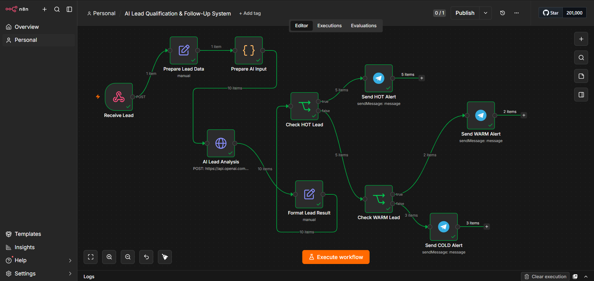

[AI Lead Qualification & Follow-Up System.md](https://github.com/user-attachments/files/31161720/AI.Lead.Qualification.Follow-Up.System.md)
# 🤖 AI Lead Qualification & Follow-Up System

> **AI-powered n8n automation that receives leads, analyzes their sales
> potential, classifies them by priority, and instantly routes alerts to
> Telegram.**



------------------------------------------------------------------------

## ✨ Overview

This project demonstrates a practical **AI-powered lead qualification
system** built with **n8n**.

The workflow automatically:

**Receives → Prepares → Analyzes → Scores → Classifies → Routes →
Alerts**

Each lead is classified as:

-   🔥 **HOT** --- high purchase intent
-   🟡 **WARM** --- relevant opportunity, but not ready yet
-   🔵 **COLD** --- low current buying intent

The result is delivered automatically to Telegram so a sales team can
focus on the most valuable opportunities first.

------------------------------------------------------------------------

## 🎯 Business Problem

Sales teams often receive many leads but cannot manually evaluate every
one.

This automation answers key questions automatically:

-   Is the lead ready to buy?
-   What is the available budget?
-   What service does the lead need?
-   How urgent is the request?
-   Which leads deserve immediate attention?

Instead of sending raw lead data to a salesperson, the workflow
transforms it into an **actionable sales signal**.

------------------------------------------------------------------------

## 🧠 Workflow Architecture

``` text
Incoming Lead
      │
      ▼
📥 Receive Lead
      │
      ▼
🧹 Prepare Lead Data
      │
      ▼
🧩 Prepare AI Input
      │
      ▼
🤖 AI Lead Analysis
      │
      ▼
📊 Format Lead Result
      │
      ▼
🔥 Check HOT Lead
      │
      ├──────────────► 🔥 Send HOT Alert
      │
      ▼
🟡 Check WARM Lead
      │
      ├──────────────► 🟡 Send WARM Alert
      │
      └──────────────► 🔵 Send COLD Alert
```

------------------------------------------------------------------------

## ⚙️ Workflow Components

  Node                   Responsibility
  ---------------------- -----------------------------------------------
  `Receive Lead`         Receives incoming lead data through a webhook
  `Prepare Lead Data`    Structures and prepares lead information
  `Prepare AI Input`     Builds the data sent to the AI
  `AI Lead Analysis`     Performs AI-powered lead qualification
  `Format Lead Result`   Combines AI results with original lead data
  `Check HOT Lead`       Detects HOT leads
  `Send HOT Alert`       Sends HOT leads to Telegram
  `Check WARM Lead`      Detects WARM leads
  `Send WARM Alert`      Sends WARM leads to Telegram
  `Send COLD Alert`      Sends COLD leads to Telegram

------------------------------------------------------------------------

## 📊 AI Qualification

The AI generates three key outputs.

### Lead Score

A numerical indication of the lead's potential.

### Priority

``` text
🔥 HOT
🟡 WARM
🔵 COLD
```

### Reason

A concise explanation describing why the lead received its
classification.

This makes the workflow more useful than a simple yes/no filter because
the sales team receives both the **decision** and the **reasoning**.

------------------------------------------------------------------------

## 📩 Telegram Output

Example:

``` text
🔥 HOT LEAD

👤 Name: Ahmed
📧 Email: ahmed@example.com
💰 Budget: 10000
🛠️ Service: E-commerce Website

Lead Score: 92
Priority: HOT

Reason:
Strong budget and clear requirements with
high purchase intent and a near-term start date.
```

The same routing principle is used for WARM and COLD leads.

------------------------------------------------------------------------

## 🧪 Test Results

The workflow was tested with **10 sample leads**.

  Priority       Leads Result
  ----------- -------- ----------------------------------
  🔥 HOT             5 Telegram alerts sent
  🟡 WARM            2 Telegram alerts sent
  🔵 COLD            3 Telegram alerts sent
  **Total**     **10** **10/10 processed successfully**

All three routing paths were successfully tested.

------------------------------------------------------------------------

## 🛠️ Tech Stack

-   **n8n** --- workflow automation
-   **OpenAI API** --- AI-powered analysis
-   **HTTP Request** --- API communication
-   **Webhooks** --- lead intake
-   **JavaScript** --- data preparation and logic
-   **Telegram** --- real-time notifications
-   **n8n Expressions** --- dynamic mapping and routing

------------------------------------------------------------------------

## 🔐 Security

Credentials and private configuration values are **not included** in
this repository.

For deployment:

1.  Configure your own API credentials.
2.  Configure your own Telegram credentials.
3.  Replace test data with real lead sources.
4.  Never commit API keys, bot tokens, or secrets.
5.  Review webhook security before production use.

------------------------------------------------------------------------

## 🚀 Production Extensions

This workflow can be extended into a complete AI sales automation
platform.

### CRM Integration

Automatically create or update leads in a CRM.

### Automated Follow-Up

Trigger different follow-up sequences based on HOT, WARM, or COLD
status.

### Email Alerts

Send detailed HOT lead notifications to a sales team.

### Lead Database

Store qualification results in Google Sheets, Airtable, PostgreSQL, or
another database.

### Analytics

Track:

-   Lead volume
-   HOT/WARM/COLD distribution
-   Average lead score
-   Conversion rate
-   Service demand
-   Budget distribution

### AI Outreach

Generate personalized sales messages based on each lead's needs, budget,
service, and intent.

------------------------------------------------------------------------

## 📁 Repository Structure

``` text
AI-Lead-Qualification-Follow-Up-System/
├── AI-Lead-Qualification-Follow-Up-System.json
├── README.md
└── ai-lead-qualification-workflow.png
```

------------------------------------------------------------------------

## ▶️ How to Use

### 1. Import the workflow

Import `workflow.json` into your n8n instance.

### 2. Configure credentials

Add your OpenAI and Telegram credentials.

### 3. Configure the lead source

Connect your preferred lead source to the webhook.

### 4. Test

Send sample lead data through the webhook.

### 5. Verify

Confirm that the lead is classified and delivered to the correct
Telegram branch.

------------------------------------------------------------------------

## 💡 Example Input

``` json
{
  "name": "Ahmed",
  "email": "ahmed@example.com",
  "budget": 10000,
  "service": "E-commerce Website"
}
```

The workflow transforms this raw information into an AI-assisted
qualification result.

------------------------------------------------------------------------

## 🏆 Skills Demonstrated

This project demonstrates practical experience with:

-   Workflow architecture
-   Webhook automation
-   API integration
-   AI integration
-   JavaScript data handling
-   n8n expressions
-   Conditional routing
-   Multi-branch workflows
-   Real-time notifications
-   Business-oriented automation design

------------------------------------------------------------------------

## 📌 Project Status

**Status:** 🟢 Completed

**Workflow:** Tested successfully\
**Lead routing:** 10/10 successful\
**Telegram notifications:** Working\
**AI qualification:** Working

------------------------------------------------------------------------

## 👨‍💻 Portfolio Project

### Project 8 --- AI Lead Qualification & Follow-Up System

Built with **n8n + OpenAI + Telegram** to demonstrate how AI can
transform raw lead data into prioritized, actionable sales
opportunities.

------------------------------------------------------------------------

::: 
### ⚡ Automate the work. Prioritize the opportunities. Close faster.

**n8n × AI × Automation**
:::
